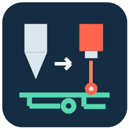

# PrevodnikNC

[English](#english) · [Česky](#česky)



## English

A desktop NC/G-code converter with a Czech user interface that turns milling toolpaths into laser paths for GRBL/LaserGRBL. It was developed for PCB fabrication: removing paint around copper traces and marking positions for manual drilling. It also merges files, mirrors and rotates paths, and provides two G-code editors.

**Version 0.5 · Python + Tkinter · no third-party Python libraries.** The application only generates files; it does not connect to a machine or start the laser.

The interface is currently in Czech. The instructions below include the actual Czech button labels alongside their English meanings.

### New in 0.5

- **Negativní rezist** generates exposure tests for negative dry-film resist. Each trace width gets its own vertical subcolumn; copper bars and gaps have equal nominal heights. Incomplete top bars are omitted. Board dimensions are never enlarged automatically.
- Tool width D sets edge offsets D/2 and a fixed 0.8 D fill step. The remaining centre gap is filled only when larger than D. Frame count is **0, 1 or 2**. All dimensions, bar counts and path counts are recorded in NC comments.
- **Ubrat kontury…** uses a matching copper Gerber to select the nearest one or two contour layers. The original input text, file and left preview remain unchanged; exclusions apply only to the output. **Vrátit kontury** restores them.
- Review dialogs show the entire drawing automatically once their canvas is visible, in normal-size windows. Pan with the right mouse button; zoom with the wheel.
- Compact controls, saved settings, named recipes, atomic saves and session recovery. Statistics are at the top right; redundant lower panels have been removed.
- The negative switch affects test generation; it does not invert arbitrary imported NC toolpaths.

### Features

- Input and output path previews, millimetre rulers, zoom and pan.
- Conversion based on Z height or M3/M4, M5 and S power values.
- Configurable output power and feed rate, with M3/M4 selection.
- X/Y mirroring and 90°, 180° or 270° rotation.
- Multiple NC inputs combined into one output in the order they were added.
- Circular drill-position marks, with a default diameter of 0.3 mm.
- Two editors with line numbers, Ctrl+G, Ctrl+Z and error-line highlighting.
- A separate power/feed-rate test matrix generator.
- Standard open/save dialogs and protection against losing unsaved changes.

### Running the application

Windows is the primary platform. Install Python 3.10 or later with Tkinter, then run:

```console
python PrevodnikNC.py
```

On Windows, you can also double-click `spustit_PrevodnikNC.cmd`. The launcher first checks for an existing Python installation in an adjacent SVG_to_G-code project; otherwise, it uses `py -3`. That adjacent folder is not required. No packages need to be installed with pip.

The application icon is `PrevodnikNC.ico`. Select it in your shortcut's properties. The optional Windows script `vytvorit_ikonu.ps1` creates the icon and a local `PrevodnikNC.lnk` shortcut that you can copy to your desktop. The shortcut is not included in the repository because it contains an absolute path specific to the local computer.

### Your first conversion

1. Click **Otevřít NC…** (Open NC) to load an input. Use `examples/obrys.nc` to try it out.
2. Set the feed rate in mm/min and the **S** power value according to your controller configuration. S is not a percentage. The power field is intentionally blank by default.
3. Optionally select mirroring or rotation, then click **Konvert** (Convert).
4. The right-hand preview is generated from the actual output G-code.
5. Click **Uložit NC…** (Save NC) to save the contents of the right-hand editor under your chosen filename.

Before running a file on your machine, check its coordinates, dimensions, orientation and laser settings. The examples are synthetic geometry, not a calibrated process profile for a particular machine.

#### Conversion modes

- **Automaticky** (Automatic): inputs containing Z coordinates are interpreted using Z height; other inputs use laser commands.
- **Podle Z** (By Z height): G1/G2/G3 working moves are burned when Z is at or below the specified threshold. G0 moves are not burned. The output contains no Z commands.
- **Podle M3/M5 a S** (By M3/M5 and S): working moves are burned while M3/M4 is active and S > 0. Select this mode manually for laser files that only use Z to set the focus height.

The selected output feed rate and power replace the original values for all inputs. Path order is preserved. The laser is switched off before travel moves and after working paths.

### Merging files and marking drill positions

After opening the first file, click **Přidat soubor…** (Add file). Try adding `examples/vrtani.nc` to the example outline. The selector at the top switches the file shown in the left-hand editor; **Odebrat** (Remove) removes it from the assembly only. The left-hand graphical preview shows the complete assembly.

Each input is interpreted separately, including its units and modal commands. The output contains a single M2 program end, so the end of the first input does not prevent the next part from running.

**Značit vrtací vpichy Z** (Mark Z drilling plunges) detects a G1 plunge from above the Z threshold to or below it, followed by a return above the threshold with no intervening XY movement. A travel endpoint or entry into an outline cut is not treated as a hole. Repeated plunges at the same position within one file produce a single mark.

Marks are closed circles approximated by at least 32 G1 segments. Their diameter is adjustable. Marks are appended to the end of the corresponding file's paths; the log reports the number of detected positions. Drilling must be expressed as explicit NC/G-code moves: direct Excellon import and G81/G83 drilling cycles are not supported.

### Mirroring and rotation

Mirroring is performed around the centre of the combined working-path bounds. **Obrátit X** (Mirror X) swaps left and right; **Obrátit Y** (Mirror Y) swaps top and bottom.

Rotation is applied afterwards, counterclockwise. It preserves the minimum X/Y coordinates of the working-path bounds; 90° and 270° rotations swap the width and height. Travel moves receive the same transformation and may lie outside those bounds.

All inputs must use a common coordinate system and the same initial orientation. Do not combine already mirrored outlines with unmirrored drilling. The application does not automatically align files or move them inside the machine's working limits.

### Previews and editors

Use the mouse wheel to zoom and drag with the right mouse button to pan. Double-click or use **Celý výkres** (Fit entire drawing) to show the full extent. Rulers display millimetres, with Y increasing upwards. Review dialogs fit the drawing after the canvas becomes visible, without maximizing the window.

The **Editory G-code** (G-code editors) tab lets you edit both input and output. Ctrl+A selects text, Ctrl+Z undoes changes, and Ctrl+G goes to a line. A parser error opens the relevant input and highlights the problematic line.

**Obnovit náhled** (Refresh preview) processes the editor's current text. **Konvert** reads the current text of all inputs. **Uložit jako…** (Save as) on the left saves only the selected input; the output save buttons save the exact contents of the right-hand editor, including manual changes. Previewing an unsupported command may fail, but its text can still be edited and saved.

Changing parameters or adding a file does not overwrite the right-hand editor; new output is only generated by another conversion. Unsaved changes are marked, and the application asks before discarding them. Long paths are abbreviated; hover over them to see the full path.

### Tool changes and pauses

A block from T through the next M6, inclusive, is removed before interpreting geometry. The log lists the skipped source-line range. An isolated T or M6 is removed on its own; the search for M6 stops at another T or the end of the program.

The application also recognises a `(MSG, Change to Tool…)` comment and an immediately following M0 after T or M6. This pause belongs to the tool change and is removed. Other M0 commands are preserved as pauses with the laser switched off.

### Test matrix

A separate tab generates hatched test cells within an area specified by X/Y, width and height. You can configure row/column counts, gaps, line spacing, and power/feed-rate ranges. Power increases from left to right, and feed rate increases from bottom to top. The legend is not burned; it is included in NC header comments. The test is saved separately. You choose the available area manually.

### Supported commands and limitations

The parser supports modal G0/G1, G2/G3 arcs in the G17 plane with relative I/J centres, G20/G21, G90/G91, G91.1, G94, M3/M4/M5, standalone M0, and M2/M30 program endings. Arcs are converted to G1 segments with a maximum chord error of 0.005 mm before coordinate rounding.

The first XY position must be known and specified with G0. Simultaneous changes in XY and Z, R-format arcs, compensation commands, origin changes and drilling cycles are rejected with a line number. The application does not calculate isolation paths from Gerber files or modify the CAM Tool Diameter/Overlap settings.

### Tests

```console
python -m unittest -v test_nc_core
python test_gui_smoke.py
```

Tests cover geometry, units, mirroring, rotation, tool-change removal, pauses, drill marks, file merging, and GUI editing/saving. The GUI test requires an environment with Tk. Two additional regression tests use private manufacturing fixtures and are skipped when those files are absent. Those fixtures are not distributed.

### License

GNU General Public License v2.0 — see [LICENSE](LICENSE).

---

## Česky

Český desktopový převodník NC/G-code z frézování na laserové dráhy pro GRBL/LaserGRBL. Vznikl pro výrobu PCB: odstranění barvy kolem spojů a označení míst pro ruční vrtání. Umí také spojovat soubory, zrcadlit a otáčet dráhy a upravovat G-code ve dvou editorech.

**Verze 0.5 · Python + Tkinter · bez externích Python knihoven.** Program pouze vytváří soubory; nepřipojuje se ke stroji ani nespouští laser.

## Funkce

- Náhled vstupních a výstupních drah, pravítka v mm, zoom a posun.
- Převod podle výšky Z nebo podle M3/M4, M5 a výkonu S.
- Nastavení výstupního výkonu a rychlosti, volba M3/M4.
- Zrcadlení X/Y a otočení o 90°, 180° nebo 270°.
- Přidání více NC souborů a společný export v pořadí přidání.
- Kroužky pro označení vrtacích bodů, výchozí průměr 0,3 mm.
- Dva editory s číslováním řádků, Ctrl+G, Ctrl+Z a označením chybového řádku.
- Samostatný generátor testovací matice výkonu a rychlosti.
- Standardní dialogy otevření a uložení, ochrana neuložených změn.

## Spuštění

Primární prostředí je Windows. Nainstalujte Python 3.10 nebo novější s Tkinterem a spusťte:

```console
python PrevodnikNC.py
```

Na Windows lze použít dvojklik na `spustit_PrevodnikNC.cmd`. Spouštěč zkusí existující Python v sousedním projektu SVG_to_G-code, jinak použije `py -3`. Tato sousední složka není nutná. Není třeba instalovat žádné balíčky přes pip.

Ikona je v `PrevodnikNC.ico`. Nastavte ji ve vlastnostech svého zástupce. Volitelný skript `vytvorit_ikonu.ps1` na Windows vytvoří ikonu a místního zástupce `PrevodnikNC.lnk`, který můžete zkopírovat na plochu. Zástupce není součástí repozitáře, protože obsahuje absolutní cestu místního počítače.

## První převod

1. **Otevřít NC…** načte vstup. Pro vyzkoušení je zde `examples/obrys.nc`.
2. Nastavte rychlost v mm/min a výkon **S** podle konfigurace řadiče. S není procento. Pole výkonu je záměrně prázdné.
3. Případně nastavte zrcadlení nebo otočení a stiskněte **Konvert**.
4. Pravý náhled se načte ze skutečného vygenerovaného G-code.
5. **Uložit NC…** uloží obsah pravého editoru pod vybraným názvem.

Před použitím na stroji zkontrolujte souřadnice, rozměry, orientaci a nastavení laseru. Ukázky jsou syntetické geometrické podklady, nikoliv odladěný technologický profil konkrétního stroje.

### Režimy převodu

- **Automaticky:** vstup obsahující Z se vyhodnotí podle výšky Z; jinak podle příkazů laseru.
- **Podle Z:** pracovní pohyb G1/G2/G3 se pálí při Z menším nebo rovném zadané hranici. G0 se nepálí. Výstup neobsahuje Z.
- **Podle M3/M5 a S:** pracovní pohyb se pálí při aktivním M3/M4 a S > 0. Pro laserový soubor s nastavením Z jen pro ostření zvolte tento režim ručně.

Výstupní rychlost a výkon nahradí původní hodnoty pro všechny vstupy. Pořadí drah se zachovává. Před přejezdy a po pracovních drahách je laser vypnutý.

## Spojení souborů a značky děr

Po otevření prvního souboru použijte **Přidat soubor…**. Vyzkoušet lze přidání `examples/vrtani.nc` k ukázkovému obrysu. Seznam nahoře přepíná soubor v levém editoru; **Odebrat** jej odebere jen ze sestavy. Levý grafický náhled zobrazuje celou sestavu.

Při konverzi se každý vstup vyhodnotí samostatně, včetně jednotek a modálních příkazů. Výstup obsahuje jediný konec programu M2, takže ukončení prvního souboru nepřeruší další část.

Volba **Značit vrtací vpichy Z** rozpozná pracovní sjezd G1 z výšky nad hranicí Z na hranici nebo pod ni a následný návrat nad hranici bez pohybu XY. Pouhý konec přejezdu ani vstup do obrysového řezu se za díru nepovažují. Opakované vpichy stejného bodu v jednom souboru vytvoří jednu značku.

Značky jsou uzavřené kroužky z nejméně 32 úseček G1. Průměr je nastavitelný. Značky se přidají na konec drah příslušného souboru. Podporovány jsou vpichy rozepsané v NC/G-code, nikoliv přímý import Excellon ani vrtací cykly G81/G83.

## Zrcadlení a otočení

Zrcadlení se provede kolem středu společného rozsahu pracovních drah. **Obrátit X** převrátí levou a pravou stranu; **Obrátit Y** horní a dolní.

Otočení se provede poté, proti směru hodinových ručiček. Zachová minimum X/Y rozsahu pracovních drah; při 90° a 270° prohodí šířku a výšku. Stejnou transformací projdou přejezdy, které mohou ležet mimo tento rozsah.

Všechny vstupy musí používat společný souřadný systém a stejnou výchozí orientaci. Již zrcadlené obrysy nekombinujte s nezrcadleným vrtáním. Program soubory automaticky nezarovnává ani nepřesouvá do pracovních limitů stroje.

## Náhled a editory

Kolečkem přibližujete, pravým tlačítkem táhnete obraz. Dvojklik nebo **Celý výkres** obnoví celý rozsah. Pravítka ukazují milimetry, osa Y roste nahoru. Kontrolní dialogy zobrazí celý výkres po skutečném zobrazení plátna, bez maximalizace okna.

V záložce **Editory G-code** můžete upravovat vstup i výstup. Ctrl+A vybere text, Ctrl+Z vrací změny a Ctrl+G přejde na řádek. Chyba parseru otevře příslušný vstup a zvýrazní problémové místo.

**Obnovit náhled** zpracuje aktuální text editoru. **Konvert** čte aktuální text všech vstupů. **Uložit jako…** vlevo ukládá pouze vybraný vstup; tlačítka pro uložení výstupu ukládají přesný text pravého editoru včetně ručních změn. Náhled nepodporovaného příkazu může selhat, ale jeho text lze stále editovat a uložit.

Změna parametrů ani přidání souboru nepřepíše pravý editor; nový výstup vznikne až dalším převodem. Neuložené změny jsou označené a program se před jejich zahozením zeptá. Dlouhé cesty se zkracují; najetí myší ukáže celou cestu.

## Výměny nástrojů a pauzy

Blok od T po následující M6 včetně se odstraní před vyhodnocením geometrie. Samotné T nebo M6 se vynechá jednotlivě; hledání M6 se zastaví u dalšího T nebo konce programu.

Rozpoznává se také komentář `(MSG, Change to Tool…)` a bezprostředně následující M0 za T nebo M6. Tato pauza patří k výměně nástroje a odstraní se. Ostatní M0 zůstávají jako pauzy s vypnutým laserem.

## Testovací matice

Samostatná záložka vytvoří šrafovaná políčka do plochy zadané X/Y, šířkou a výškou. Nastavit lze počet řádků/sloupců, mezery, rozteč čar, rozsah výkonů a rychlostí. Výkon roste zleva doprava, rychlost zdola nahoru. Legenda se nepálí; je v komentářích na začátku NC. Test se ukládá samostatně. Volnou plochu určujete ručně.

## Podporované příkazy a omezení

Parser podporuje modální G0/G1, oblouky G2/G3 v rovině G17 s relativním středem I/J, G20/G21, G90/G91, G91.1, G94, M3/M4/M5, samostatné M0 a ukončení M2/M30. Oblouky převádí na G1 s chybou tětivy nejvýše 0,005 mm před zaokrouhlením souřadnic.

První XY poloha musí být známá a zadaná G0. Smíšený měnící se pohyb XY a Z, oblouky R, korekce, změny počátku a vrtací cykly se odmítají s číslem řádku. Program nepočítá izolační kontury z Gerberu ani nemění CAM parametry Tool Diameter/Overlap.

## Testy

```console
python -m unittest -v test_nc_core
python test_gui_smoke.py
```

Testy pokrývají geometrii, jednotky, zrcadlení, otáčení, odstranění výměn nástroje, pauzy, značení děr, spojování souborů a editaci/ukládání v GUI. GUI test vyžaduje prostředí s Tk. Dva doplňkové regresní testy používají soukromé výrobní podklady a bez nich se přeskočí. Tyto podklady nejsou distribuované.

## Licence

GNU General Public License v2.0 — viz [LICENSE](LICENSE).


## Doplnění 6. 10. 2026: recepty, testovací editor a statistika

- V horním řádku napište název technologického receptu a poznámku, potom zvolte **Uložit recept**. Výběr existujícího receptu vyplní parametry převodu včetně zrcadlení, otočení, značek otvorů a rychlosti G0 pro odhad. Změny polí se uloží do receptu až tlačítkem; existující G-code se změní až novou konverzí. Recepty jsou v `%APPDATA%/PrevodnikNC/recepty.json`; tento soubor lze zálohovat a přenést na další počítač.
- Test výkonu a rychlosti má záložku **Editor G-code**. Rozpis celé matice je v komentářích na začátku souboru, řádky zdola, sloupce zleva. Ukládání používá přesný obsah editoru. Změna parametrů dosavadní text nemaže a opětovné generování se ptá před zahozením neuloženého textu. **Kopírovat vše** je ve všech třech editorech; lze tak použít Poznámkový blok při problémech s ukládáním.
- Statistika v pravém horním rámečku vychází z výsledného G-kódu: délka pálení, délka přejezdů, počet pracovních drah a ideální čas XY. Pracovní úseky používají skutečné F, rychloposuv používá zadanou rychlost G0. Nezahrnuje akceleraci, pauzy ani příjezd z neznámé počáteční polohy. Oblouky se měří po aproximaci parseru. Po ruční editaci obnovte náhled.
- **Přidat soubor** zobrazí po výběru souboru a před jeho připojením společný náhled: stávající data modře, kandidát oranžově. Červená znamená otvory mimo rozsah pracovních obrysů s tolerancí 0,5 mm; oranžová znamená pouze souhlas rozsahu, nikoli potvrzení orientace nebo totožnosti PCB. Šedá znamená chybějící podklady pro automatické srovnání. Soubor lze odmítnout bez změny sestavy. Nativní dialog Windows samotný tuto kontrolu nezobrazuje. Zelené potvrzení není použito, protože rozsah neumí spolehlivě určit zrcadlení.

### Odebrání jedné nebo dvou kontur nejblíž k mědi

1. Otevřete NC. Pro samotný výběr kontur nemusí být výkon a rychlost ještě vyplněné. U více vstupů vyberte v seznamu ten, který obsahuje izolační kontury.
2. Klikněte na **Ubrat kontury…**. Program nejprve hledá odpovídající Gerber mědi ve stejné složce podle názvu NC (např. `odstup-B_Cu.gbrl.nc` → `odstup-B_Cu.gbr`). Ověřuje označení vrstvy Copper; jiné názvy a obrys desky automaticky nevybírá. Při chybějícím souboru nebo více odpovídajících Gerberech nabídne ruční výběr. Název použitého Gerberu je v titulku kontrolního okna. Gerber musí být ze stejného návrhu a ve stejných souřadnicích jako vstupní NC. Společné zrcadlení/otočení převodníku se použije až při následném exportu.
3. Vyberte **1** nebo **2** vrstvy od mědi. Zelená plocha představuje měď, oranžové dráhy se odeberou, modré zůstanou. Výběr lze jednotlivě změnit dvojklikem v seznamu nebo Shift+klikem na dráhu. Kolečko přibližuje náhled.
4. **Použít výběr kontur** uloží vyřazení. Je-li vyplněný kladný výkon S a rychlost, rovnou vytvoří laserový výstup v pravém editoru. Jinak ponechá dosavadní výstup beze změny a vyzve k doplnění těchto hodnot a stisku **Konvert**. Vstupní NC zůstává nezměněn; u jeho názvu se objeví počet vyřazených kontur. Tlačítko **Vrátit kontury** tento výběr zruší a znovu provede převod. Opakovaný výběr vždy vychází z původních drah, nikoli z již zmenšeného výsledku.

Výběr používá odstup od skutečné mědi, nikoli pořadí řádků nebo vnoření obrysů. Kontroluje vrcholy a mezilehlé body nejvýše 0,25 mm od sebe, seskupuje odstupy s tolerancí 0,008 mm. Otevřené, zasahující do mědi nebo nerovnoměrně vzdálené dráhy automaticky ponechává a označí k ověření. Jde o návrh vyžadující kontrolu náhledu, nikoli obecnou rekonstrukci průchodů CAM. Nepoužívejte Gerber s jiným posunem či zrcadlením než vstupní NC.

Čtení Gerberu je záměrně omezené: pozitivní měď, tmavé lineární i kruhové tahy G02/G03 v režimu G75 kruhovou aperturou, plošky C/R/O a ověřená definice KiCad RoundRect bez rotace. Regiony, starší jednokvadrantové oblouky G74, světlá polarita, opakování a ostatní makra se odmítnou s vysvětlením; nic se potichu nevynechá. Formát vychází ze [specifikace Ucamco](https://www.ucamco.com/en/gerber). Vzdálenost od kruhových tahů se počítá analyticky včetně směru a konců oblouku; pouze jejich vykreslení se aproximuje. Žádné další knihovny se neinstalují.

Změna textu daného vstupu nebo režimu/hranice Z zruší jeho výběr kontur, protože by už neodpovídala čísla drah. Změny výkonu, rychlosti, zrcadlení a otočení výběr zachovají. Zrcadlení i otočení používají původní rozsah celé sestavy, aby se po vyřazení kontur neposunuly zbývající dráhy či vrtací značky.

### Obnova práce a odolnější ukládání

Editory se zálohují po 1,5 sekundě bez další úpravy; po převodu a vytvoření testu ihned. Obnovovací kopie obsahuje všechny vstupy, výstupní i testovací text, parametry a výběr vyřazených kontur. Najdete ji v `%APPDATA%/PrevodnikNC/obnova/`. Každé spuštění má vlastní soubor s datem a časem a starší relace se nemažou. Tlačítkem **Obnovit práci…** vyberte příslušnou kopii. Obnovené texty jsou označené jako neuložené a lze je ihned kopírovat; náhledy obnovte tlačítkem editoru.

Horní řádek ukazuje čas úspěšné kopie, případně výrazné hlášení o selhání. Obnovovací kopie nepomůže, pokud systém blokuje zápis i do tohoto umístění; tehdy zůstává možnost **Kopírovat vše**. NC soubory i kopie se zapisují přes dočasný soubor ve stejné složce a až po dokončení nahrazují cíl. Odmítnutí závěrečného zápisu tak nezkrátí původní soubor na prázdný.


### Test šířky spojů při leptání

**Matice se spoji** nyní ponechává vodorovné zůstatky mědi. Laser jede souvisle podél jejich dlouhých hran, nepřerušuje pohyb u každého spoje. Výchozí šířky **0,3; 0,5; 0,8; 1 mm** jsou v každém vzorku uspořádané **zdola nahoru**. Mezi nimi se pálí plošný rastr. Šířky lze upravit, oddělují se středníkem; desetinná čárka i tečka fungují.

Pro porovnání úzkých izolačních mezer zvolte **Spoje: 1/2/3 průjezdy**. Každé políčko kombinace S/F obsahuje tři vzorky vedle sebe: **zleva 1, 2 a 3 sousední vodorovné dráhy** v každé mezeře, včetně mezery pod prvním a nad posledním spojem. Pole Rozteč čar určuje jmenovitou šířku nástroje pro test: první osa leží polovinu této hodnoty od hrany mědi, další sousední osy mají krok 80 % hodnoty (20% překrytí). Při hodnotě **0,2 mm** jde o první odsazení **0,1 mm** a další krok **0,16 mm**. Všechny tři vzorky mají totožné S/F a stejné šířky spojů; více sousedních drah rozšíří izolační pásmo. Dráhy se jedou stejným směrem, návrat probíhá s vypnutým laserem. Jde vždy o sousední dráhy s 20% překrytím; opakování stejné dráhy není součástí testu.

Šířky spojů jsou požadované jmenovité šířky mědi, jako v návrhu PCB. Nejbližší osy jsou vně obou hran o polovinu zadané rozteče: pro spoj 0,5 mm a rozteč 0,2 mm jsou osy vzdálené 0,7 mm. To platí pro oba testy se spoji; převod již hotových PCB drah se tím nemění. Skutečnou šířku mědi ovlivní stopa laseru a leptání. Rozpis orientace, šířek a průjezdů se zapisuje do hlavičky NC . Pokud se vzorky nevejdou, program vypíše potřebnou minimální šířku či výšku celé matice; rozměry spojů nestlačuje. Vnitřní propojení mezi třemi vzorky zůstávají záměrně zachovaná. Test proto není určen pro samostatné elektrické měření každého vnitřního proužku. Pro původní plně vypalovaná políčka zůstává **Plošná matice**. Všechny varianty mají editor, kopírování a obnovovací kopie.

### Obvodové oddělení celých políček

Volba **Obrysy celého políčka** přidá **1 nebo 2 uzavřené obdélníkové dráhy** kolem celého pole S/F; hodnota 0 je vypne. Uvnitř pole se nic dalšího neodděluje: tři vzorky 1/2/3 a jejich vnitřní propojení zůstávají zachované. Obrysy se provedou po vnitřních drahách a se stejnými S/F jako příslušné políčko. Každý obrys se objede právě jednou, při přejezdu na další je laser vypnutý.

**Šířka stopy obrysu [mm]** určuje rozteč těchto obrysů při pevném 20% překrytí: rozteč = 0,8 × šířka stopy. Například 0,2 mm znamená rozteč 0,16 mm. Jde o zadanou předpokládanou šířku vypálené stopy, nikoli o měření programem; nastavte ji podle svého laseru. Rozteč vnitřních drah zůstává samostatným parametrem Rozteč čar.

Obrysy využívají mezery mezi políčky. Na vnější straně matice se rezervuje okraj, aby se i celá jmenovitá šířka stopy vešla do zadané plochy. Při příliš malé mezeře či ploše program požádá o zvětšení rozměrů; šířky zkušebních spojů se nemění. Počet, šířka stopy a překrytí se zapisují do hlavičky NC.

### Spuštění přes EXE ve Windows

Hotová místní sestava je v `dist/PrevodnikNC/PrevodnikNC.exe`. Spouští se přímo, bez BAT/CMD a bez samostatně nainstalovaného Pythonu. Při povolování aplikace pro zápis ve Windows vyberte právě tento EXE. Při přesunu či kopírování přeneste celou složku `dist/PrevodnikNC`, včetně `_internal`; na plochu lze vytvořit zástupce samotného EXE. Recepty a obnovovací kopie používají stejnou složku AppData jako původní Python verze.

EXE obsahuje stav zdrojů v okamžiku sestavení. Po dalších úpravách programu je nutné sestavu obnovit příkazem `python build_exe.py`. Sestavovací závislost se instaluje lokálně příkazem `python -m pip install --target .build-tools pyinstaller`. Ověřené sestavení: Python 3.14.5 / PyInstaller 6.22.3. Je-li aplikace spuštěná, `python build_exe.py --staged` připraví novou verzi do `build/exe-staging/PrevodnikNC`; na původní místo se kopíruje až po zavření programu. Sestavení automaticky provede kontrolu spuštění zabaleného Tk rozhraní a zápisu testovacího NC do dočasné složky. Povolení zápisu do chráněných uživatelských složek je třeba ověřit po povolení EXE ve Windows.


### Zapamatování posledních voleb

Všechny hodnoty polí převodu i testu, zrcadlení, volby laseru, počet odebíraných kontur, název a poznámka receptu, zobrazení přejezdů, záložky a poslední adresář se automaticky ukládají do `%APPDATA%/PrevodnikNC/nastaveni.json`. Změny se ukládají po půlsekundové prodlevě a také při potvrzeném zavření programu, i bez vytvořeného G-code. Při novém spuštění se načtou automaticky. Neplatný číselný rozepsaný text se zachová; jeho kontrola probíhá před zpracováním. Poškozený soubor nastavení nebrání spuštění a aplikace oznámí problém. Pojmenované recepty a obnovovací kopie rozpracovaného G-code jsou nadále samostatné; nastavení samo neotevírá předchozí NC ani nespouští převod.


### Samostatné obdélníky v testu 1/2/3

Každá zadaná šířka určuje vlastní měděný obdélník. Pod i nad ním je vlastní sada 1, 2 nebo 3 drah. Obdélníky mají ve všech třech vzorcích stejné polohy a rozměry. První osa je polovinu zadané rozteče od hrany, další krok je 80 % rozteče. Mezi jmenovitými stopami nejvzdálenějších drah sousedních obdélníků je ve vzorku se třemi drahami 0,3 mm; u menšího počtu drah je volné místo větší. Dráhy se nesdílejí. Pokud zadaná výška nestačí, aplikace oznámí chybu a zadané rozměry ponechá beze změny. Vnější obrysy nadále obepínají celé pole S/F a vnitřní boční propojení zůstávají.


## Negativní rezist — sloupečky a pevná plocha (9. 10. 2026)

Přepínač Negativní rezist zapíná osvit budoucí mědi. Každé S/F pole se rozdělí do tolika svislých sloupečků, kolik je zadaných šířek spojů. Šířky jsou zleva v pořadí zadání. Mezera sloupečků je samostatně nastavitelná, výchozí 0,5 mm. V každém sloupečku se zdola opakuje mezera W a obdélník výšky W. Poslední neúplný obdélník se vynechá; horní zbytková mezera neslouží k porovnání.

Rozměry plochy se nikdy automaticky nepřepisují, ani u testu pro barvu. Rozměr S/F pole je (celkový rozměr − součet mezer mezi poli) / počet polí. Obrysy celého pole se řídí volbou 0/1/2 a šířkou stopy obrysu; v negativu se vejdou celé dovnitř vyhrazeného pole. Vnitřní prostor se rozdělí mezi sloupečky po odečtení jejich mezer. Při nemožném nastavení se zobrazí chyba bez změny zadaných hodnot.

D je hodnota Rozteč čar. Krajní osy výplně jsou D/2 uvnitř hran obdélníku, výplň postupuje od obou stran krokem 0,8 D. Zbývající vzdálenost os nejvýše D se ponechá, větší zbytek se doplní středovou drahou. Rozpis NC obsahuje rozměry pole, sloupečků, počty obdélníků i drah. Výběr Aktivní soubor a posun náhledu pravým tlačítkem zůstávají zachovány.


## Rychlý postup pro negativní rezist

1. Otevřete **Test výkonu a rychlosti** a zapněte **Negativní rezist**.
2. Zadejte skutečnou použitelnou šířku a výšku zbytku desky, X/Y, počty S/F polí a jejich mezery. Rozměry se automaticky nezvětšují.
3. Zadejte šířky spojů oddělené středníkem, například `0,3; 0,5; 0,8; 1`. Každá šířka dostane vlastní sloupeček zleva doprava. Mezera sloupečků je samostatná, výchozí 0,5 mm.
4. Nastavte D v poli **Rozteč čar**. Musí být nejvýše tak velké jako nejužší spoj. Odsazení krajních os je D/2 a krok 0,8 D. Uprostřed se podle potřeby přidá jediná dráha; ostatní rozteče zůstávají pevné.
5. Zadejte S/F a obrysy **0/1/2**. S jsou hodnoty řídicí jednotky, ne automaticky procenta. Rám se v negativu vejde do vyhrazeného pole a zmenší dostupný vnitřní prostor.
6. Klikněte na **Vytvořit test**, zkontrolujte náhled a **Uložit test NC…**. Úplný rozpis najdete na začátku **Editoru G-code**. Text legendy se laserem nepálí.
7. Po výrobě porovnávejte souvislé měděné obdélníky se stejně vysokými čistě vyleptanými mezerami. Poslední horní mezera se k porovnání nepoužívá. Program neověřuje fyzický výsledek osvitu ani leptání.

## Porovnání originálu a výsledku

**Aktivní soubor** určuje levý editor a soubor pro úpravu kontur. Převod a společný náhled zahrnují všechny načtené vstupy. **Ubrat kontury…** nemění zdrojový soubor ani jeho text. Levý náhled zachová úplný originál, pravý ukazuje konverzi včetně odebrání kontur a transformací. To platí i po obnovení náhledu a obnovení relace. Ruční editace vstupního textu je samostatná operace.

Dialogy **Ubrat kontury…** a kontroly přidávaného NC se otevírají v běžné velikosti. Po dokončení rozložení plátna automaticky provedou stejné přizpůsobení jako **Celý výkres**. Pozdější ruční přiblížení a posun se nepřepisují. V hlavních náhledech se zbytečné spodní výzvy a protokoly nezobrazují; chyby zpracování se zobrazují v dialogu. Statistika a vysvětlení odhadu času jsou vpravo nahoře.

## Ověření vývoje

```console
python -m unittest -v test_nc_core test_features test_contours test_negative test_preferences
python test_gui_smoke.py
python test_contour_gui.py
python test_preview_fit.py
```

Poslední test používá skutečně zobrazená Tk okna: kontroluje automatické přizpůsobení proti ručnímu tlačítku v obou dialozích a zachování ručního zoomu. Vyžaduje grafickou relaci. Sestavení EXE provádí navíc vlastní `--self-test`.
